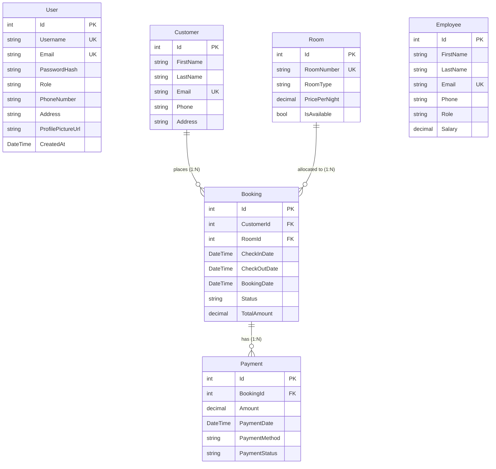
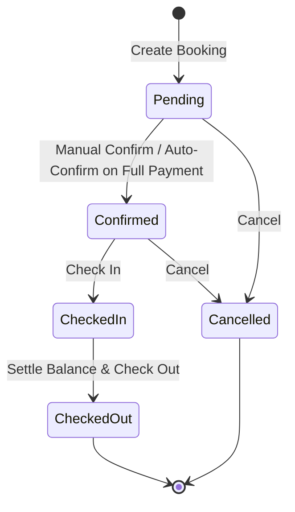

# The Haunted Hotel: Management System

A full-stack hotel management system built with **ASP.NET Core (.NET 9)** and **React 19**. The backend follows Clean Architecture with Entity Framework Core and SQL Server, while the frontend is a Vite-powered React SPA with a custom dark-themed UI.

## Tech Stack

| Layer | Technology |
|---|---|
| Backend | ASP.NET Core Web API (.NET 9), C# |
| Database | SQL Server, Entity Framework Core 9 |
| Authentication | JWT Bearer Tokens, BCrypt password hashing |
| Frontend | React 19, Vite, React Router v7 |
| HTTP Client | Axios (with JWT interceptors) |
| UI Components | Lucide React icons, React Hot Toast |
| Styling | Vanilla CSS (custom dark theme) |
| Testing | xUnit, EF Core InMemory provider |
| API Docs | Swagger / OpenAPI |

---

## Table of Contents

- [Features](#features)
  - [1. Registration](#1-registration)
  - [2. Login](#2-login)
  - [3. Dashboard](#3-dashboard)
  - [4. Navigation](#4-navigation)
  - [5. Room Management](#5-room-management)
  - [6. Customer Management](#6-customer-management)
  - [7. Booking Management](#7-booking-management)
  - [8. Payment Management](#8-payment-management)
  - [9. Employee Management](#9-employee-management)
  - [10. User Profile](#10-user-profile)
- [Project Structure](#project-structure)
- [Database Schema](#database-schema)
- [Booking Lifecycle](#booking-lifecycle)
- [API Endpoints](#api-endpoints)
- [Testing](#testing)
- [Getting Started](#getting-started)
- [License](#license)

---

## Features

### 1. Registration

Users can create a new account by providing their **username**, **email**, **password**, **role** (Admin or Staff), **phone number**, and **address**. Passwords are hashed with BCrypt before storage. Duplicate emails and usernames are rejected. On successful registration, a JWT token is issued and the user is logged in automatically.


---

### 2. Login

Registered users can log in using their **email** and **password**. The server verifies the credentials against the BCrypt hash and returns a JWT token valid for 8 hours. The token is stored in localStorage and attached to all subsequent API requests via an Axios interceptor. If the token expires or is invalid, the user is redirected back to the login page.


---

### 3. Dashboard

The dashboard is the main landing page after login. It gives a complete overview of the hotel's current state at a glance.


**Summary Cards** across the top show:
- **Total Rooms** (9 rooms across 4 categories)
- **Available Rooms** (8 rooms ready for check-in)
- **Occupied Rooms** (0 currently checked-in, 0% occupancy)
- **Active Bookings** (2 bookings that are pending, confirmed, or checked-in)
- **Total Customers** (8 registered customer profiles)
- **Total Revenue** ($2,308,500 collected from paid transactions)

**Occupancy Overview** displays an SVG donut chart breaking down room status into Available, Occupied (Checked In), and Reserved/Pending categories with progress bars for each.

**Booking Status Distribution** shows the count and percentage of all reservations grouped by status: Confirmed (1), Checked In (0), Pending Payment (1), Checked Out (10), and Cancelled (1) out of 13 total reservations.

**Monthly Revenue (Last 6 Months)** is a bar chart tracking paid transaction totals month by month, with hover tooltips showing exact amounts.

**Monthly Occupancy Trend** visualizes room occupancy percentage over the last 6 months calculated on a room-days basis.


**Occupancy by Room Category** breaks down utilization rates per room type (Deluxe, Normal, Penthouse, Suite) showing how many rooms are occupied out of the total in each category.

**Financial Ledger & Collections** displays the Total Collected amount ($2,308,500) and Outstanding Balance ($759,500), along with a breakdown of reservation payment statuses: Fully Paid (10), Partially Paid (1), and Unpaid (1).

**Recent Reservations** lists the 5 most recent bookings with booking ID, room number, customer name, dates, amount, and current status.

**Recent Transactions** lists the 5 most recent payments with payment ID, linked booking, payment method (Cash, Bank Transfer, etc.), amount, and status.

**Hotel Administrative Quick Actions** at the bottom provides shortcut buttons for common tasks: New Reservation, Manage Inventory, Customer Directory, Record Payment, Customer Check-in, and Customer Check-out.

---

### 4. Navigation

The sidebar navigation lets users move between all sections of the application. It is organized into groups:

- **Overview**: Dashboard
- **Management**: Rooms, Customers, Bookings
- **Finance**: Payments, Employees

The sidebar footer shows the currently logged-in user's avatar, username, and role, with a logout button. Clicking the user section opens the profile modal. On mobile devices, the sidebar collapses into a hamburger menu.


---

### 5. Room Management

The rooms page displays all hotel rooms in a table with columns for Room Number, Type, Price Per Night, and Status (Available or Under Maintenance).

**Admin users** can:
- Add a new room by specifying the room number, room type (Standard, Deluxe, Suite, Penthouse), price per night, and availability status (Available or Under Maintenance).
- Edit any existing room's details.
- Delete a room, as long as it has no active bookings (Pending, Confirmed, or CheckedIn). If it does, the deletion is blocked with a clear error message.

**Staff users** can only view the room list. The Add, Edit, and Delete buttons are not shown for Staff accounts.

Room numbers are unique across the system. Trying to create or rename a room to a number that already exists will be rejected.


---

### 6. Customer Management

The customers page manages the hotel's customer directory. Each customer record stores a **first name**, **last name**, **email**, **phone number**, and **address**.

Users can:
- **Add a new customer** by filling in all the required details through a modal form.
- **Edit** any existing customer's information by clicking the edit icon on their row.
- **Delete** a customer using the delete icon. However, if a customer has any existing booking records, the deletion is blocked to preserve data integrity.

There is also a **search bar** at the top that filters customers in real-time by name or email as you type (with a debounce so it doesn't fire on every keystroke).

Customer emails must be unique. The system rejects duplicate emails on both creation and update.


---

### 7. Booking Management

The bookings page handles all reservations. Bookings can be filtered using tabs: **All**, **Pending**, **Confirmed**, **Checked In**, **Checked Out**, and **Cancelled**.

To **create a new booking**, the user selects a customer and an available room from dropdown lists, then picks the check-in and check-out dates. The system automatically calculates the total amount on the server side based on the number of nights multiplied by the room's price per night. A room that is under maintenance or already booked by someone else for overlapping dates cannot be selected.

Each booking row shows contextual action buttons depending on its current status:
- **Pending** bookings can be cancelled or deleted (only if no payments have been recorded against them).
- **Confirmed** bookings can be checked in or cancelled.
- **Checked In** bookings can be checked out, but only after the full payment has been settled (remaining balance must be zero).

The booking status follows this flow:

`Pending` -> `Confirmed` -> `Checked In` -> `Checked Out`

At any point before check-in, a booking can also be `Cancelled`. When a booking's payment is fully completed, the status automatically changes from Pending to Confirmed.


---

### 8. Payment Management

The payments page has two parts: a transaction history table and a payment recording form.

To record a payment, the user enters a **Booking ID** in the form. The system automatically fetches and displays the booking's **total amount**, **paid amount**, and **remaining amount**. The user then enters the payment amount (which cannot exceed the remaining balance) and selects a payment method (Cash, Credit Card, Debit Card, or Bank Transfer).

Once a booking's remaining amount reaches zero (fully paid), the booking status is automatically promoted from **Pending** to **Confirmed**. From there, the hotel staff can manually transition the booking through **Check In** and **Check Out** from the bookings page as the customer arrives and departs.

Payments cannot be recorded against cancelled bookings, and the system prevents overpayment.

The transaction history table lists every recorded payment with its ID, linked booking, amount, method, status, and date.


---

### 9. Employee Management

The employee section manages hotel staff records like chefs, security personnel, managers, receptionists, and housekeeping staff.

**Only Admin users** can add, edit, or delete employee records. Staff users can view the employee directory but cannot make changes.

Each employee record includes:
- First name and last name
- Email (must be unique)
- Phone number
- Role (e.g., Manager, Receptionist, Chef, Security, Housekeeping)
- Salary


---

### 10. User Profile

Clicking the user section at the bottom of the sidebar opens a profile modal where the logged-in user can view and edit their account details.

The profile modal allows updating:
- **Profile picture** (upload from device, with a 2MB size limit, stored as base64)
- **Username** (checked for uniqueness against other users)
- **Phone number**
- **Address**

There is also a **Change Password** section where the user needs to enter their current password for verification, then the new password and confirmation.


---

## Project Structure

The solution follows **Clean Architecture (Onion Architecture)** with strict separation of concerns across four layers:

```
HotelManagement/
│
├── src/
│   ├── HotelManagement.Domain/          # Core Domain Entities
│   │   └── Entities/                    # Room, Customer, Booking, Payment, Employee, User
│   │
│   ├── HotelManagement.Application/     # Application Business Logic
│   │   ├── DTOs/                        # Request/Response Data Transfer Objects
│   │   ├── Interfaces/                  # Repository & Service Contracts
│   │   └── Services/                    # Domain Service Implementations
│   │
│   ├── HotelManagement.Infrastructure/  # Infrastructure & Persistence
│   │   ├── Data/                        # HotelDbContext & EF Core Configurations
│   │   ├── Migrations/                  # EF Core Database Migrations
│   │   └── Repositories/               # Repository Implementations
│   │
│   └── HotelManagement.API/            # Web API Layer
│       ├── Controllers/                 # RESTful Endpoints
│       ├── Exceptions/                  # Global Exception Handler (RFC 7807 ProblemDetails)
│       └── Program.cs                   # DI Configuration, JWT Auth, Swagger Setup
│
├── frontend/                            # React 19 + Vite Frontend SPA
│   ├── src/
│   │   ├── api/                         # Axios instance with JWT interceptors
│   │   ├── components/                  # Layout, Modals, DataTables, Badges, Profile
│   │   ├── context/                     # AuthContext state provider
│   │   └── pages/                       # Dashboard, Bookings, Rooms, Customers, etc.
│
└── tests/
    └── HotelManagement.Tests/           # xUnit Unit & Integration Tests (EF Core InMemory)
```

---

## Database Schema



**Constraints:**
- `Room.PricePerNight`, `Booking.TotalAmount`, `Payment.Amount`, and `Employee.Salary` are configured as `decimal(18, 2)`.
- Unique indexes on `Room.RoomNumber`, `Customer.Email`, `Employee.Email`, `User.Email`, and `User.Username`.
- All foreign keys use `DeleteBehavior.Restrict` to prevent orphaning financial and reservation records. The application layer also catches these cases and surfaces clear error messages before hitting the database.

---

## Booking Lifecycle



**Rules:**
- A booking starts as `Pending` on creation.
- When the full payment is recorded, the status auto-promotes to `Confirmed`.
- Only `Confirmed` bookings can be checked in.
- Only `CheckedIn` bookings can be checked out, and only when the remaining balance is zero.
- `Pending` and `Confirmed` bookings can be cancelled at any time.
- Bookings with existing payment records cannot be deleted. Cancel instead to keep the financial history.
- Overlapping date ranges for the same room are rejected. `Cancelled` and `CheckedOut` bookings do not block availability.

---

## API Endpoints

All endpoints except `/api/auth/*` require a valid JWT token in the `Authorization: Bearer <token>` header.

### Auth (Public)
| Method | Route | Description |
|---|---|---|
| POST | `/api/auth/register` | Register a new user |
| POST | `/api/auth/login` | Log in and receive JWT |

### Profile
| Method | Route | Description |
|---|---|---|
| GET | `/api/profile` | Get current user's profile |
| PUT | `/api/profile` | Update profile details |
| PUT | `/api/profile/change-password` | Change account password |

### Dashboard
| Method | Route | Description |
|---|---|---|
| GET | `/api/dashboard` | Get all dashboard analytics data |

### Rooms
| Method | Route | Description |
|---|---|---|
| GET | `/api/rooms` | List all rooms |
| GET | `/api/rooms/{id}` | Get room by ID |
| POST | `/api/rooms` | Create room (Admin only) |
| PUT | `/api/rooms/{id}` | Update room (Admin only) |
| DELETE | `/api/rooms/{id}` | Delete room (Admin only) |
| GET | `/api/rooms/available?checkInDate=...&checkOutDate=...` | Get available rooms for date range |

### Customers
| Method | Route | Description |
|---|---|---|
| GET | `/api/customers` | List all customers (supports `?search=`) |
| GET | `/api/customers/{id}` | Get customer by ID |
| POST | `/api/customers` | Create customer |
| PUT | `/api/customers/{id}` | Update customer |
| DELETE | `/api/customers/{id}` | Delete customer |
| GET | `/api/customers/{id}/bookings` | Get booking history for a customer |

### Bookings
| Method | Route | Description |
|---|---|---|
| GET | `/api/bookings` | List bookings (supports `?status=`) |
| GET | `/api/bookings/{id}` | Get booking by ID |
| POST | `/api/bookings` | Create booking |
| PUT | `/api/bookings/{id}` | Update booking dates/room |
| PATCH | `/api/bookings/{id}/confirm` | Confirm a pending booking |
| PATCH | `/api/bookings/{id}/check-in` | Check in |
| PATCH | `/api/bookings/{id}/check-out` | Check out (requires full payment) |
| PATCH | `/api/bookings/{id}/cancel` | Cancel booking |
| DELETE | `/api/bookings/{id}` | Delete booking (only if no payments) |

### Payments
| Method | Route | Description |
|---|---|---|
| GET | `/api/payments` | List all payments |
| GET | `/api/payments/{id}` | Get payment by ID |
| POST | `/api/payments` | Record a payment |
| GET | `/api/payments/booking/{bookingId}` | Get payments for a booking |
| GET | `/api/payments/booking/{bookingId}/summary` | Get payment summary (total, paid, remaining) |

### Employees
| Method | Route | Description |
|---|---|---|
| GET | `/api/employees` | List all employees |
| GET | `/api/employees/{id}` | Get employee by ID |
| POST | `/api/employees` | Create employee |
| PUT | `/api/employees/{id}` | Update employee |
| DELETE | `/api/employees/{id}` | Delete employee |

---

## Testing

The test suite is in `tests/HotelManagement.Tests` and uses xUnit with EF Core's InMemory database provider. No external database is needed to run tests.

**Test files:**
- `AuthServiceTests.cs` - Registration, login, duplicate email rejection, invalid password handling
- `BookingServiceTests.cs` - Total calculation, date validation, overlap detection, full lifecycle transitions, checkout balance enforcement, deletion rules
- `PaymentServiceTests.cs` - Partial payments, full payment, overpayment prevention, cancelled booking rejection
- `RoomAndCustomerServiceTests.cs` - Unique room numbers, safe deletion, customer search, customer booking history
- `RoomAvailabilityTests.cs` - Date overlap logic, status-based blocking, self-exclusion on updates

Run all tests:
```bash
dotnet test tests/HotelManagement.Tests/HotelManagement.Tests.csproj
```

---

## Getting Started

### Prerequisites
- [.NET 9.0 SDK](https://dotnet.microsoft.com/download)
- [Node.js v18+](https://nodejs.org/)
- [SQL Server](https://www.microsoft.com/sql-server) (Express or LocalDB works fine)

### 1. Backend Setup

1. Navigate to the API project directory:
   ```bash
   cd src/HotelManagement.API
   ```

2. Configure your SQL Server connection string in `appsettings.json` (or `appsettings.Development.json`):
   ```json
   {
     "ConnectionStrings": {
       "DefaultConnection": "Server=localhost;Database=HotelManagementDb;Trusted_Connection=True;TrustServerCertificate=True;"
     },
     "Jwt": {
       "Key": "HotelManagement_Super_Secret_Key_At_Least_32_Chars!",
       "Issuer": "HotelManagementAPI",
       "Audience": "HotelManagementClient"
     }
   }
   ```

3. Apply database migrations:
   ```bash
   dotnet ef database update --project ../HotelManagement.Infrastructure
   ```

4. Run the API server:
   ```bash
   dotnet run
   ```
   The backend starts at `http://localhost:5048`. Swagger UI is available at `http://localhost:5048/swagger` in development mode.

---

### 2. Frontend Setup

1. Navigate to the frontend directory:
   ```bash
   cd frontend
   ```

2. Install dependencies:
   ```bash
   npm install
   ```

3. Start the Vite development server:
   ```bash
   npm run dev
   ```
   The frontend starts at `http://localhost:5173`. The Vite dev server proxies all `/api` requests to `http://localhost:5048`, so both servers need to be running at the same time.

---

### 3. Running Unit Tests

Run the full xUnit test suite from the repository root:
```bash
dotnet test tests/HotelManagement.Tests/HotelManagement.Tests.csproj
```

---

## License

This project is licensed under the [MIT License](https://opensource.org/licenses/MIT).

Copyright (c) 2026 Shafikul Islam Marwan

Permission is hereby granted, free of charge, to any person obtaining a copy of this software and associated documentation files (the "Software"), to deal in the Software without restriction, including without limitation the rights to use, copy, modify, merge, publish, distribute, sublicense, and/or sell copies of the Software, and to permit persons to whom the Software is furnished to do so, subject to the following conditions:

The above copyright notice and this permission notice shall be included in all copies or substantial portions of the Software.

THE SOFTWARE IS PROVIDED "AS IS", WITHOUT WARRANTY OF ANY KIND, EXPRESS OR IMPLIED, INCLUDING BUT NOT LIMITED TO THE WARRANTIES OF MERCHANTABILITY, FITNESS FOR A PARTICULAR PURPOSE AND NONINFRINGEMENT. IN NO EVENT SHALL THE AUTHORS OR COPYRIGHT HOLDERS BE LIABLE FOR ANY CLAIM, DAMAGES OR OTHER LIABILITY, WHETHER IN AN ACTION OF CONTRACT, TORT OR OTHERWISE, ARISING FROM, OUT OF OR IN CONNECTION WITH THE SOFTWARE OR THE USE OR OTHER DEALINGS IN THE SOFTWARE.
