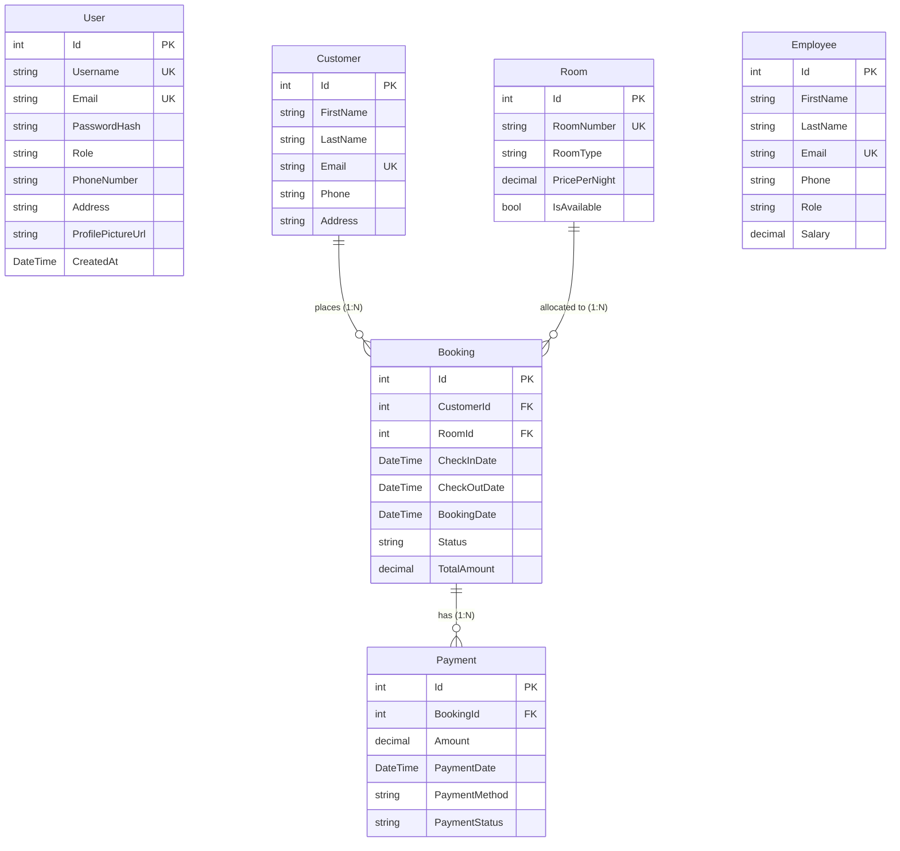
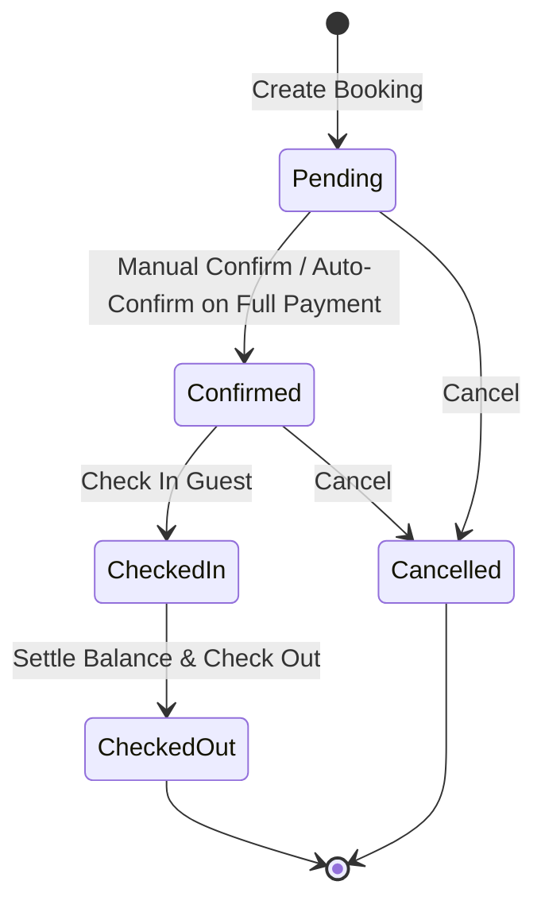

# 🏨 The Haunted Hotel — Hotel Management System

[](https://dotnet.microsoft.com/)
[](https://react.dev/)
[](https://vitejs.dev/)
[](https://learn.microsoft.com/en-us/ef/core/)
[](https://www.microsoft.com/sql-server)
[](https://jwt.io/)
[](https://xunit.net/)

An enterprise-grade, full-stack boutique hotel management platform built with **ASP.NET Core Web API (.NET 9)** adhering to **Clean Architecture** principles and a modern **React SPA** with a bespoke luxury dark aesthetic.

---

## 📑 Table of Contents

- [Overview](#-overview)
- [Key Features & Screenshots](#-key-features--screenshots)
  - [Executive Dashboard & Analytics](#1-executive-dashboard--analytics)
  - [Room & Inventory Management](#2-room--inventory-management)
  - [Reservation & Booking Engine](#3-reservation--booking-engine)
  - [Financial Ledger & Payment Processing](#4-financial-ledger--payment-processing)
  - [Guest & Customer Dossiers](#5-guest--customer-dossiers)
  - [Employee & Staff Administration](#6-employee--staff-administration)
  - [Authentication & Role-Based Access](#7-authentication--role-based-access)
  - [User Profile & Account Security](#8-user-profile--account-security)
- [Architecture & System Design](#-architecture--system-design)
- [Database Schema & Entity Relationships](#-database-schema--entity-relationships)
- [Booking State Machine & Invariant Enforcement](#-booking-state-machine--invariant-enforcement)
- [API Reference](#-api-reference)
- [Automated Testing Suite](#-automated-testing-suite)
- [Getting Started](#-getting-started)
  - [Prerequisites](#prerequisites)
  - [Backend Setup](#1-backend-setup)
  - [Frontend Setup](#2-frontend-setup)
  - [Running Unit Tests](#3-running-unit-tests)

---

## 🌟 Overview

**The Haunted Hotel Management System** orchestrates end-to-end hotel operations. It streamlines guest reservations, room inventory allocation, billing, staff directories, and executive telemetry with real-time feedback and strict data integrity protections.

### Highlights:
- **Clean Architecture:** Strict separation across Domain, Application, Infrastructure, and API layers.
- **Robust Invariant Enforcement:** Overlap rejection formulas, server-side dynamic billing calculations, and financial-settlement gates before checkout.
- **Executive Analytics:** Live room occupancy donut charts, 6-month revenue bar charts, monthly occupancy tracking on a true room-days basis, and debt-collection health monitors.
- **Modern Dark UI:** Tailored obsidian & antique gold luxury aesthetic built with custom CSS, responsive navigation, and micro-animations.

---

## 📸 Key Features & Screenshots

### 1. Executive Dashboard & Analytics
Real-time KPI telemetry tracking total rooms, available rooms, occupied rooms, active reservations, registered guests, and total revenue. Includes interactive charts and activity feeds.


- **Interactive SVG Donut Chart:** Visual breakdown of room states (*Available*, *Occupied*, *Reserved*).
- **6-Month Historical Revenue:** Monthly buckets tracking recognized income from paid transactions with hover tooltips.
- **6-Month Occupancy Trend:** Calculated on a true room-days occupancy basis.
- **Inventory by Category:** Utilization saturation meters for Standard, Deluxe, Suite, and Penthouse rooms.
- **Financial Ledger Status:** Live distribution of reservations (*Fully Paid*, *Partially Paid*, *Unpaid*).
- **Recent Feeds:** Live streams of recent bookings and recent payments.

---

### 2. Room & Inventory Management
Complete room inventory management with category classifications, dynamic pricing, and maintenance status tracking.


- **Role-Based Access:** Admins have full CRUD permissions; Staff have view-only access.
- **Unique Room Numbers:** Enforced at database and application levels.
- **Safe-Delete Protection:** Prevents deletion of rooms linked to active reservations (`Pending`, `Confirmed`, `CheckedIn`).
- **Dynamic Availability Engine:** Query available rooms across arbitrary date ranges with conflict-free interval checking.

---

### 3. Reservation & Booking Engine
End-to-end reservation workflow with status tracking, date validation, and conflict detection.


- **Tabbed Status Filters:** Filter by `All`, `Pending`, `Confirmed`, `Checked In`, `Checked Out`, or `Cancelled`.
- **Server-Side Total Calculation:** Automatically computes `TotalAmount = Nights * Room.PricePerNight` on the backend to prevent client tampering.
- **Interactive Action Triggers:** Direct contextual triggers for **Check In**, **Check Out**, **Cancel**, and **Delete**.
- **Customer & Room Resolution:** Dynamic name and room number lookups across relations.

---

### 4. Financial Ledger & Payment Processing
Immutable financial ledger recording payments against bookings with support for partial payments and overpayment prevention.


- **Real-Time Summary Card:** Automatically fetches and displays Total, Paid Amount, and Remaining Balance when a Booking ID is selected.
- **Overpayment Guard:** Automatically rejects payments exceeding the outstanding balance.
- **Auto-Confirm Promotion:** Automatically transitions a `Pending` booking to `Confirmed` once the total balance is settled.
- **Checkout Guard:** Blocks guest checkout if any unpaid balance remains.

---

### 5. Guest & Customer Dossiers
Centralized guest database with contact details and reservation histories.


- **Debounced Live Search:** Fast client-debounced search across first name, last name, and email.
- **Referential Integrity:** Deletion blocked if the customer has booking history (`DeleteBehavior.Restrict`).
- **Customer Booking History:** Access historical bookings per guest profile.

---

### 6. Employee & Staff Administration
Staff directory tracking operational personnel, department roles, contact information, and payroll.


- **Role Management:** Categorize staff as *Manager*, *Receptionist*, *Housekeeping*, etc.
- **Unique Email Enforcement:** Prevents duplicate employee profile creation.
- **Salary Tracking:** Decimal precision `(18, 2)` formatting.

---

### 7. Authentication & Role-Based Access
Secure authentication with JWT bearer tokens, BCrypt password hashing, and role claims.

| Login Screen | Registration Screen |
| :---: | :---: |
|  |  |

- **8-Hour Session Duration:** Secure HMAC-SHA256 JWT tokens.
- **Axios Interceptors:** Automatic token attachment on outgoing requests and automated redirection on `401 Unauthorized`.
- **Role Enforcement:** Distinct privileges for `Admin` and `Staff`.

---

### 8. User Profile & Account Security
Interactive modal accessible from the sidebar user badge for viewing profile information, updating details, and changing passwords.

| User Profile Modal | Collapsible Navigation Sidebar |
| :---: | :---: |
|  |  |

- **Avatar Upload:** In-browser image upload with client-side 2MB validation and base64 preview encoding.
- **Profile Editing:** Update username (with collision validation), phone number, and address.
- **Password Reset:** In-place password change requiring verification of the current password.

---

## 🏗 Architecture & System Design

The solution follows **Clean Architecture (Onion Architecture)** to maintain strict separation of concerns and testability:

```
HotelManagement/
│
├── src/
│   ├── HotelManagement.Domain/          # Core Domain Entities
│   │   └── Entities/                    # Room, Customer, Booking, Payment, Employee, User
│   │
│   ├── HotelManagement.Application/     # Application Business Logic
│   │   ├── DTOs/                        # Request/Response Data Transfer Objects
│   │   ├── Interfaces/                  # Repository & Service Contracts
│   │   └── Services/                    # Domain Service Implementations
│   │
│   ├── HotelManagement.Infrastructure/  # Infrastructure & Persistence
│   │   ├── Data/                        # HotelDbContext & EF Core Configurations
│   │   ├── Migrations/                  # EF Core Database Migrations
│   │   └── Repositories/                # Repository Implementations
│   │
│   └── HotelManagement.API/             # Web API Layer
│       ├── Controllers/                 # RESTful Endpoints
│       ├── Exceptions/                  # Global Exception Handler (RFC 7807 ProblemDetails)
│       └── Program.cs                   # DI Configuration, JWT Auth, Swagger Setup
│
├── frontend/                            # React 19 + Vite Frontend SPA
│   ├── src/
│   │   ├── api/                         # Axios instance with JWT interceptors
│   │   ├── components/                  # Layout, Modals, DataTables, Badges, Profile
│   │   ├── context/                     # AuthContext state provider
│   │   └── pages/                       # Dashboard, Bookings, Rooms, Customers, etc.
│
└── tests/
    └── HotelManagement.Tests/           # xUnit Unit & Integration Tests (EF Core InMemory)
```

---

## 🗄 Database Schema & Entity Relationships



### Database Constraints & Configurations:
- **Precision:** `Room.PricePerNight`, `Booking.TotalAmount`, `Payment.Amount`, and `Employee.Salary` are set to `decimal(18, 2)`.
- **Unique Indexes:** `Room.RoomNumber`, `Customer.Email`, `Employee.Email`, `User.Email`, and `User.Username`.
- **Foreign Key Delete Behavior:** `DeleteBehavior.Restrict` on all relations to ensure financial and reservation audit logs are never orphaned.

---

## 🔄 Booking State Machine & Invariant Enforcement



### Key Business Invariants:
1. **Overlap Rejection:**
   $$\text{Overlap} \iff (\text{Existing.CheckIn} < \text{Requested.CheckOut}) \land (\text{Existing.CheckOut} > \text{Requested.CheckIn})$$
   Active statuses (`Pending`, `Confirmed`, `CheckedIn`) block room availability; `Cancelled` and `CheckedOut` do not.
2. **Server-Side Total Calculation:**
   $$\text{Nights} = \max(1, (\text{CheckOutDate.Date} - \text{CheckInDate.Date}).\text{Days})$$
   $$\text{TotalAmount} = \text{Nights} \times \text{Room.PricePerNight}$$
3. **Rescheduling Protection:** Updating dates recalculates the total bill. New total amounts cannot drop below what has already been paid.
4. **Financial Settlement Gate:** Guests cannot be checked out (`CheckedIn` ➔ `CheckedOut`) if `RemainingAmount > 0`.
5. **Safe Deletion:** Bookings with payment records cannot be deleted; cancellation must be used instead to maintain the financial ledger.

---

## 📡 API Reference

| Method | Endpoint | Access | Description |
| :--- | :--- | :--- | :--- |
| `POST` | `/api/auth/register` | Public | Register new user account |
| `POST` | `/api/auth/login` | Public | Authenticate user & issue JWT |
| `GET` | `/api/profile` | Authenticated | Get current authenticated user profile |
| `PUT` | `/api/profile` | Authenticated | Update username, phone, address, avatar |
| `PUT` | `/api/profile/change-password` | Authenticated | Change user account password |
| `GET` | `/api/dashboard` | Authenticated | Fetch aggregated analytics & KPI data |
| `GET` | `/api/rooms` | Authenticated | List all rooms |
| `GET` | `/api/rooms/{id}` | Authenticated | Get room by ID |
| `POST` | `/api/rooms` | **Admin** | Create new room |
| `PUT` | `/api/rooms/{id}` | **Admin** | Update existing room |
| `DELETE`| `/api/rooms/{id}` | **Admin** | Delete room (if no active bookings) |
| `GET` | `/api/rooms/available` | Authenticated | Query available rooms by date range |
| `GET` | `/api/customers` | Authenticated | List customers (supports `?search=`) |
| `GET` | `/api/customers/{id}` | Authenticated | Get customer by ID |
| `POST` | `/api/customers` | Authenticated | Create customer record |
| `PUT` | `/api/customers/{id}` | Authenticated | Update customer record |
| `DELETE`| `/api/customers/{id}` | Authenticated | Delete customer (if no booking history) |
| `GET` | `/api/customers/{id}/bookings` | Authenticated | Get all bookings for a customer |
| `GET` | `/api/bookings` | Authenticated | List bookings (supports `?status=`) |
| `GET` | `/api/bookings/{id}` | Authenticated | Get booking by ID |
| `POST` | `/api/bookings` | Authenticated | Create new booking |
| `PUT` | `/api/bookings/{id}` | Authenticated | Reschedule/update booking |
| `PATCH` | `/api/bookings/{id}/confirm` | Authenticated | Confirm a pending booking |
| `PATCH` | `/api/bookings/{id}/check-in` | Authenticated | Check-in a confirmed booking |
| `PATCH` | `/api/bookings/{id}/check-out` | Authenticated | Check-out (requires zero remaining balance) |
| `PATCH` | `/api/bookings/{id}/cancel` | Authenticated | Cancel a reservation |
| `DELETE`| `/api/bookings/{id}` | Authenticated | Delete booking (only if zero payments exist) |
| `GET` | `/api/payments` | Authenticated | List all financial transactions |
| `GET` | `/api/payments/{id}` | Authenticated | Get payment by ID |
| `POST` | `/api/payments` | Authenticated | Record payment against booking |
| `GET` | `/api/payments/booking/{id}` | Authenticated | Get all payments for a booking |
| `GET` | `/api/payments/booking/{id}/summary` | Authenticated | Get balance summary (Total, Paid, Remaining) |
| `GET` | `/api/employees` | Authenticated | List all employees |
| `GET` | `/api/employees/{id}` | Authenticated | Get employee by ID |
| `POST` | `/api/employees` | Authenticated | Create employee record |
| `PUT` | `/api/employees/{id}` | Authenticated | Update employee record |
| `DELETE`| `/api/employees/{id}` | Authenticated | Delete employee record |

---

## 🧪 Automated Testing Suite

The application is backed by comprehensive unit and integration tests located in `tests/HotelManagement.Tests` using **xUnit** and **EF Core InMemory Database**:

- **`AuthServiceTests.cs`:** Registration, token issuance, duplicate email rejections, and BCrypt credential checks.
- **`BookingServiceTests.cs`:** Server-side total calculation, invalid date rejection, overlap conflict prevention, full lifecycle state transitions, checkout balance gates, and payment deletion blocks.
- **`PaymentServiceTests.cs`:** Partial and full payment tracking, overpayment rejection, and auto-confirmation upon full payment.
- **`RoomAndCustomerServiceTests.cs`:** Unique room numbers, safe deletion checks, debounced customer search, and customer booking history isolation.
- **`RoomAvailabilityTests.cs`:** Date boundary validation, status-based room blocking, and exclusion of self-booking IDs on updates.

---

## 🚀 Getting Started

### Prerequisites
- [.NET 9.0 SDK](https://dotnet.microsoft.com/download)
- [Node.js (v18+)](https://nodejs.org/)
- [SQL Server](https://www.microsoft.com/sql-server) (or SQL Server Express / LocalDB)

---

### 1. Backend Setup

1. Navigate to the API project directory:
   ```bash
   cd src/HotelManagement.API
   ```

2. Configure your SQL Server connection string in `appsettings.json` (or `appsettings.Development.json`):
   ```json
   {
     "ConnectionStrings": {
       "DefaultConnection": "Server=localhost;Database=HotelManagementDb;Trusted_Connection=True;TrustServerCertificate=True;"
     },
     "Jwt": {
       "Key": "HotelManagement_Super_Secret_Key_At_Least_32_Chars!",
       "Issuer": "HotelManagementAPI",
       "Audience": "HotelManagementClient"
     }
   }
   ```

3. Apply database migrations:
   ```bash
   dotnet ef database update --project ../HotelManagement.Infrastructure
   ```

4. Run the API server:
   ```bash
   dotnet run
   ```
   *The backend will start at `http://localhost:5048` (Swagger UI available at `http://localhost:5048/swagger`).*

---

### 2. Frontend Setup

1. Navigate to the frontend directory:
   ```bash
   cd frontend
   ```

2. Install dependencies:
   ```bash
   npm install
   ```

3. Start the Vite development server:
   ```bash
   npm run dev
   ```
   *The frontend will start at `http://localhost:5173`.*

---

### 3. Running Unit Tests

Run the full xUnit test suite from the repository root:
```bash
dotnet test tests/HotelManagement.Tests/HotelManagement.Tests.csproj
```

---

## 📄 License

This project is developed for educational and portfolio demonstration purposes. All rights reserved.
