## Table of Contents
* [1. Introduction](#1-introduction)
  * [1.1 Problem Statement](#11-problem-statement)
  * [1.2 Case Study with Problem Identification](#12-case-study-with-problem-identification)
  * [1.3 Specification of Overall High-Level Goals](#13-specification-of-overall-high-level-goals)
* [2. Feasibility Analysis](#2-feasibility-analysis)
  * [2.1 Technical Feasibility](#21-technical-feasibility)
  * [2.2 Operational Feasibility](#22-operational-feasibility)
  * [2.3 Economic Feasibility and Cost-Benefit Analysis](#23-economic-feasibility-and-cost-benefit-analysis)
  * [2.4 Project Schedule and GANTT Chart](#24-project-schedule-and-gantt-chart)
* [3. Business Requirement Analysis](#3-business-requirement-analysis)
  * [3.1 Information Gathering](#31-information-gathering)
  * [3.2 Goals and Objectives](#32-goals-and-objectives)
  * [3.3 Detailed Business Processes](#33-detailed-business-processes)
  * [3.4 Stakeholder Identification](#34-stakeholder-identification)
  * [3.5 Scope Definition (In-Scope and Out-of-Scope)](#35-scope-definition)
  * [3.6 Requirements Validation Matrix](#36-requirements-validation-matrix)
* [4. Software Requirements Specification (SRS)](#4-software-requirements-specification-srs)
  * [4.1 Functional Requirements](#41-functional-requirements)
  * [4.2 Non-Functional Requirements](#42-non-functional-requirements)
  * [4.3 System Models and Diagrams using UML](#43-system-models-and-diagrams-using-uml)
    * [4.3.1 Use Case Diagram](#431-use-case-diagram)
    * [4.3.2 Class Diagram (Domain Model)](#432-class-diagram-domain-model)
    * [4.3.3 Sequence Diagram: Booking Creation](#433-sequence-diagram-booking-creation)
    * [4.3.4 Sequence Diagram: Payment and Status Promotion](#434-sequence-diagram-payment-and-status-promotion)
    * [4.3.5 Activity Diagram: Guest Lifecycle](#435-activity-diagram-guest-lifecycle)
    * [4.3.6 Entity-Relationship Diagram (ERD)](#436-entity-relationship-diagram-erd)
    * [4.3.7 Relational Database Schema Specifications](#437-relational-database-schema-specifications)
    * [4.3.8 Data Flow Diagram: Level 0 (Context Diagram)](#438-data-flow-diagram-level-0-context-diagram)
    * [4.3.9 Data Flow Diagram: Level 1 (Decomposition Diagram)](#439-data-flow-diagram-level-1-decomposition-diagram)
* [5. Software Development](#5-software-development)
  * [5.1 Backend Architectural Design (Clean Architecture)](#51-backend-architectural-design-clean-architecture)
  * [5.2 Dependency Injection and Security Pipeline](#52-dependency-injection-and-security-pipeline)
  * [5.3 Categorized RESTful API Endpoints](#53-categorized-restful-api-endpoints)
  * [5.4 Global Exception Handling and Error Pipeline](#54-global-exception-handling-and-error-pipeline)
  * [5.5 Frontend UX/UI Design System and State Pipeline](#55-frontend-uxui-design-system-and-state-pipeline)
  * [5.6 User Interface Implementations and Screenshots](#56-user-interface-implementations-and-screenshots)
* [6. Software Testing](#6-software-testing)
  * [6.1 Testing Methodology and Framework](#61-testing-methodology-and-framework)
  * [6.2 Test Suite Breakdown and Verification Matrix](#62-test-suite-breakdown-and-verification-matrix)
* [7. Software Implementation and Deployment](#7-software-implementation-and-deployment)
  * [7.1 Prerequisites](#71-prerequisites)
  * [7.2 Backend Setup and Database Migrations](#72-backend-setup-and-database-migrations)
  * [7.3 Frontend Setup and Development Execution](#73-frontend-setup-and-development-execution)
  * [7.4 Verification and Test Execution](#74-verification-and-test-execution)
* [8. Conclusion and Future Scopes](#8-conclusion-and-future-scopes)

---

## 1. Introduction

### 1.1 Problem Statement
In traditional hospitality operations, hotels relying on manual registers, standalone spreadsheets, or fragmented desktop software face critical operational inefficiencies. Front desk personnel frequently encounter double booking errors, untracked room maintenance states, delayed check-in procedures, arithmetic calculation errors in multi-night billing, uncoordinated shift handovers, and a lack of real-time managerial visibility into occupancy and revenue trends.

The primary objective of this project is to eliminate these operational bottlenecks by engineering a modern, secure, and centralized web-based hotel management system. The platform integrates room inventory management, guest registration, reservation lifecycles, payment ledger accounting, staff payroll administration, and executive analytics into a unified software solution.

### 1.2 Case Study with Problem Identification
**Context:** "The Haunted Hotel" is a boutique hospitality establishment featuring four distinct room tiers: Standard (Normal), Deluxe, Suite, and Penthouse. It operates a 24/7 reception desk handling direct walk-ins, phone reservations, billing settlements, and employee shift schedules.

**Identified Operational Bottlenecks:**
* **Room State Discrepancies:** Rooms undergoing maintenance or cleaning are occasionally marked as vacant on physical boards, leading to erroneous guest allocations.
* **Unlinked Guest History:** Returning customers are recorded as new entries, preventing personalized service and historical inquiry.
* **Complex Multi-Night Billing:** Calculating rates for multi-night stays with partial advance payments and late checkout extensions is error-prone when done manually.
* **Unstructured Shift Handover:** Cash collections and pending balances are poorly communicated between morning, evening, and night shifts.

**Proposed Solution:** A web-based management system built with ASP .NET Core (.NET 10) Clean Architecture and React 19 SPA, providing instant room status updates, server-enforced total calculations, strict payment balancing, and role-based access.

### 1.3 Specification of Overall High-Level Goals
1. **Centralized Room Inventory:** Maintain a single real-time source of truth for room states (Available vs. Occupied vs. Under Maintenance) and tier pricing.
2. **Automated Booking Lifecycle:** Guide reservations through a structured lifecycle: Pending -> Confirmed -> Checked In -> Checked Out / Cancelled.
3. **Server-Side Financial Integrity:** Ensure all total amounts and outstanding balances are computed server-side, preventing client-side tampering and overpayments.
4. **Visual Operational Intelligence:** Provide an executive dashboard with interactive KPI cards, occupancy donut charts, 6-month revenue bar charts, and category utilization metrics.
5. **Role-Based Security:** Protect sensitive administrative functions (employee salary management, user account provisioning) while enabling efficient front-desk operations for staff.

---

## 2. Feasibility Analysis

### 2.1 Technical Feasibility
The technical feasibility evaluates the suitability and reliability of the selected technology stack:
* **Backend:** ASP .NET Core (.NET 10) provides high performance, built-in dependency injection, asynchronous request handling, and robust middleware.
* **Frontend:** React 19 with Vite delivers a component-driven Single Page Application (SPA) with fast rendering and modular state management.
* **Database and ORM:** Microsoft SQL Server 2022 paired with Entity Framework Core 9 guarantees ACID transactional compliance, relational referential integrity, and automated schema migrations.
* **Security:** BCrypt password hashing (work factor 11) and stateless JWT Bearer tokens provide enterprise-grade authentication.

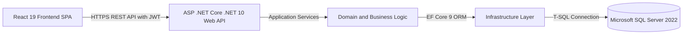

The diagram above illustrates the multi-tier architectural feasibility. The React 19 client executes entirely within the user's browser, transmitting stateless HTTPS requests authenticated via JSON Web Tokens. The ASP .NET Core (.NET 10) API layer handles request parsing, model validation, and authorization before delegating business logic to the application core. Data access is abstracted through Entity Framework Core 9, which compiles LINQ expressions into optimized SQL queries executed against Microsoft SQL Server 2022.

### 2.2 Operational Feasibility
* **User Training:** The user interface features intuitive navigation, color-coded status badges, and immediate toast notifications. Staff require less than one hour of orientation.
* **Workflow Alignment:** Mirrors standard hotel operations (Inquiry -> Room Check -> Registration -> Payment -> Check-in -> Check-out).
* **Cross-Platform Access:** Operates on standard web browsers across desktop PCs, laptops, and tablets without requiring client software installation.

### 2.3 Economic Feasibility and Cost-Benefit Analysis

| Cost Category | Tool / Framework | Cost (USD) |
|---|---|---|
| Development Tools | Visual Studio Community, VS Code, Git | $0.00 (Open Source) |
| Runtime and SDKs | .NET 10 SDK, Node.js, React 19, Vite | $0.00 (Free / Open Source) |
| Database Engine | Microsoft SQL Server Developer / Express | $0.00 (Free Tier) |
| Production Hosting | Linux / Windows VPS (2 vCPU, 4GB RAM) | ~$15.00 / month |
| Domain and SSL | Custom Domain + Let's Encrypt SSL | ~$12.00 / year |

**Benefits:**
* Eliminates physical stationery and paper register expenses completely.
* Prevents financial loss from double-booked rooms and billing calculation errors.
* Accelerates check-in/out processing time from 8 minutes to under 60 seconds.
* High Return on Investment (ROI) with immediate break-even upon deployment.

### 2.4 Project Schedule and GANTT Chart

The project was planned and executed using a 16-week structured Software Development Life Cycle (SDLC). The schedule is organized into six major phases with clear milestone deliverables:


The schedule above represents the six key phases:
1. **Planning and Requirements Analysis (Weeks 1 - 2):** Domain problem study, stakeholder interviewing, feasibility verification, and initial technical roadmap creation.
2. **Architectural Design and UML Modeling (Weeks 3 - 5):** Conceptual modeling, class diagrams, sequence flows, relational database schema normalization, and ERD finalization.
3. **Backend Development and API Implementation (Weeks 6 - 9):** Domain entities, EF Core configurations, repository patterns, JWT authentication, and RESTful controller endpoints.
4. **Frontend SPA and Dashboard Integration (Weeks 10 - 12):** React components, responsive dark theme styling, Axios interceptors, SVG charts, and state management.
5. **Automated Testing and System Verification (Weeks 13 - 14):** Comprehensive unit testing suite with xUnit and EF Core InMemory provider covering 35 test cases.
6. **Documentation, Packaging, and Defense (Weeks 15 - 16):** Final lab report compilation, deployment script verification, and academic project defense presentation.

---

## 3. Business Requirement Analysis

### 3.1 Information Gathering
* **Current System Workflow:** Paper register-based manual entries for guest names, room allocations, nightly rates, advance payments, and final settlements.
* **Identified Inefficiencies:** High risk of duplicate room allocations, arithmetic billing discrepancies, slow guest history lookup, and complete lack of graphical occupancy trends.
* **Future Scopes:** Centralized relational database, server-side rate calculation, partial payment tracking with balance verification, and real-time dashboard analytics.

### 3.2 Goals and Objectives
* Objective: "We need accurate, real-time monthly reports on occupancy and revenue across all room categories (Standard, Deluxe, Suite, Penthouse) to optimize room tariffs, eliminate overbooking, and guarantee timely billing."
* Front-desk operations must execute within 60 seconds per customer.
* Checkout must be strictly prevented until the guest's remaining balance is zero.

### 3.3 Detailed Business Processes
The complete business process follows a structured lifecycle:
1. **Inquiry and Selection:** Staff queries room inventory for requested dates.
2. **Customer Binding:** Staff selects an existing customer or creates a new profile.
3. **Reservation Initiation:** Booking created with status 'Pending'. Total amount calculated by server.
4. **Financial Settlement:** Staff records full or partial payment. On full settlement, status auto-promotes to 'Confirmed'.
5. **Check-In:** Guest arrives; status updated to 'Checked In'; room marked unavailable.
6. **Check-Out:** Guest departs; system checks remaining balance == 0; status updated to 'Checked Out'; room marked available.

### 3.4 Stakeholder Identification
* **System Administrator:** Superuser with full system access, employee payroll management, user account provisioning, and system configuration.
* **Front Desk Staff:** Operational users handling room inquiries, customer profiles, reservations, payments, check-ins, and check-outs.
* **Hotel Management:** Executive stakeholders monitoring live dashboard analytics, revenue charts, and occupancy utilization.
* **Hotel Guest (External):** Direct beneficiary receiving instant reservation confirmations and accurate itemized invoices.

### 3.5 Scope Definition
* **In-Scope:** JWT authentication, role-based authorization, CRUD for Rooms, Customers, Bookings, Payments, Employees, state machine lifecycle management, visual dashboard with SVG charts, customer search filtering.
* **Out-of-Scope:** Direct third-party OTA channel integration (Expedia/Booking.com), restaurant/laundry POS modules, multi-property chain management.

### 3.6 Requirements Validation Matrix

| Business Requirement | System Feature | Implementation Verification |
|---|---|---|
| Prevent double bookings | Room availability check and date overlap validation | IBookingRepository.IsRoomAvailableAsync |
| Server-enforced billing | Server calculates nights * rate; rejects client totals | BookingService.CalculateTotalAmount |
| Enforce complete payment before checkout | Remaining balance verification check | BookingService.CheckOutAsync balance guard |
| Category-wise occupancy reporting | Dashboard aggregated calculations | DashboardService.GetDashboardAsync |
| Secure employee payroll | Role-based policy [Authorize(Roles="Admin")] | EmployeesController access policy |

---

## 4. Software Requirements Specification (SRS)

### 4.1 Functional Requirements
* **FR-1 (Authentication):** Users register with Username, Email, Password, Role, Phone, Address. System hashes passwords using BCrypt and issues 8-hour signed JWT tokens.
* **FR-2 (Room Inventory):** Admin users manage rooms with unique RoomNumber, RoomType, PricePerNight, and IsAvailable status. Deletion blocked if active bookings exist.
* **FR-3 (Customer Directory):** Manage customer profiles with unique Email. Real-time debounced search by name/email. Deletion blocked if bookings exist.
* **FR-4 (Booking Engine):** Create bookings linking Customer and Room. Validates CheckOutDate > CheckInDate, room availability, and calculates TotalAmount server-side.
* **FR-5 (Lifecycle Transitions):** Valid transitions: Pending -> Confirmed -> CheckedIn -> CheckedOut. Cancellations permitted from Pending/Confirmed states.
* **FR-6 (Payment Ledger):** Record payments specifying BookingId, Amount, PaymentMethod (Cash, Card, Bank Transfer). Prevents overpayment. Auto-promotes Pending booking to Confirmed upon full payment.
* **FR-7 (Employee Administration):** Admin users manage employee names, emails, roles, and salaries.
* **FR-8 (Executive Analytics):** Real-time KPI cards, Occupancy Donut Chart, Booking Distribution, 6-Month Revenue Bar Chart, and Category Utilization.

### 4.2 Non-Functional Requirements
* **NFR-1 (Performance):** API responses returned in < 200ms under 50 concurrent staff sessions.
* **NFR-2 (Availability and Reliability):** 99.9% uptime. Database operations executed in ACID-compliant transactions with automatic rollback on error.
* **NFR-3 (Security):** BCrypt password hashing, JWT Bearer tokens, CORS origin protection, parameterized LINQ queries preventing SQL injection, RFC 7807 ProblemDetails error masking.
* **NFR-4 (Usability):** Custom dark-themed user interface, responsive layout (1366x768 to 4K), instant toast notifications.

---

### 4.3 System Models and Diagrams using UML

#### 4.3.1 Use Case Diagram

The Use Case diagram specifies the functional interactions between system actors and the application boundary. The system defines two primary operational personas: Front Desk Staff and Administrators. Front Desk Staff manage routine operational workflows such as guest check-in, room inquiries, reservation booking, customer profile maintenance, and payment processing. Administrators inherit all operational capabilities and have exclusive privileges over employee records, payroll compensation, system user provisioning, and room inventory configurations.

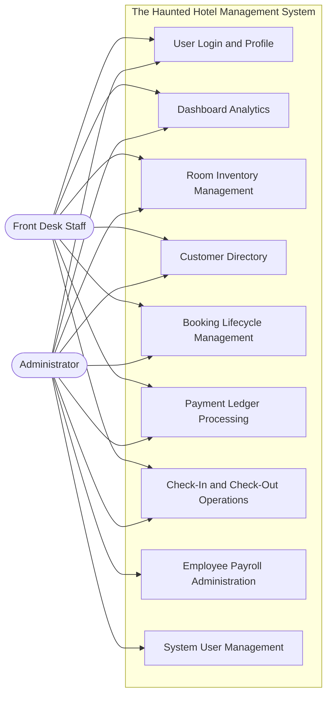

The diagram highlights the strict role separation implemented in the system. When a staff user logs in, the user interface dynamically hides administrative controls (such as the Employee Management menu and Add/Delete Room buttons). All backend endpoints enforce identical role-based policies through ASP .NET Core authorization attributes, ensuring security is consistently enforced at both the client and server levels.

#### 4.3.2 Class Diagram (Domain Model)

The Class Diagram illustrates the object-oriented structure of domain entities residing within the core layer. Each entity encapsulates its properties and data types, enforcing clean relational modeling. The `Customer` entity maintains a one-to-many relationship with `Booking`, recording all historic and active reservations associated with a guest. The `Room` entity associates with `Booking` records to track occupancy periods. Each `Booking` entity serves as a parent to zero or more `Payment` transactions, enabling partial payment installment tracking.

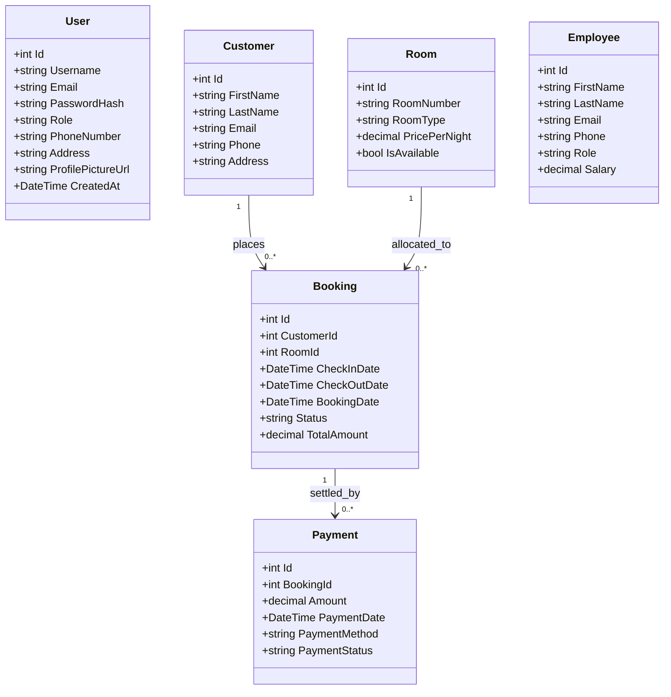

The domain entities are designed with clean separation of concerns. Properties like `TotalAmount` on `Booking` and `Amount` on `Payment` use high-precision decimal representations to guarantee financial accuracy. Relationships between entities are configured with explicit foreign keys and referential integrity constraints, preventing orphaned records and ensuring consistent database state throughout all transactions.

#### 4.3.3 Sequence Diagram: Booking Creation

This sequence diagram depicts the chronological message exchange during the reservation creation workflow. When a front-desk operator selects a guest and an available room, the React frontend submits a validated payload to the `BookingsController`. The controller delegates processing to the `BookingService`, which validates that the checkout date is strictly chronologically after the check-in date. The service then queries the `BookingRepository` to verify that no active, overlapping reservations exist for that room during the requested date window.

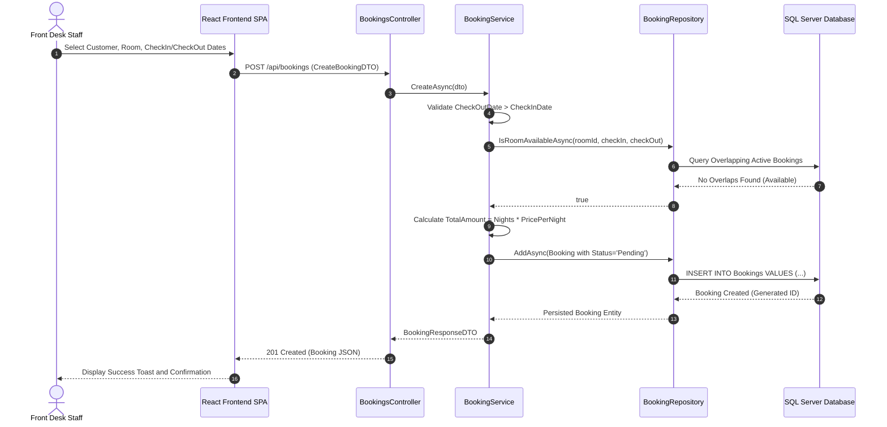

Once room availability is confirmed, the server calculates the total booking charge by multiplying the number of billed nights by the room's current nightly rate. The booking is persisted to Microsoft SQL Server with an initial status of 'Pending'. The resulting entity is mapped to a `BookingResponseDTO` and returned to the client with an HTTP 201 Created status, prompting an immediate success notification on the user interface.

#### 4.3.4 Sequence Diagram: Payment and Status Promotion

The payment sequence diagram demonstrates the financial settlement logic and automatic status promotion rules. When a payment is recorded against a reservation, the `PaymentsController` passes the payload to `PaymentService`. The service retrieves the parent booking, verifies that it is not cancelled, and queries all previous successful payments linked to that booking to determine the exact remaining balance. It verifies that the submitted payment amount is strictly positive and does not exceed the remaining unpaid amount.

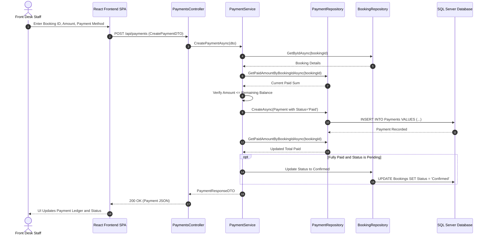

After persisting the transaction, the service recalculates the updated cumulative paid amount. If the total paid equals or exceeds the total booking cost, and the reservation is currently in 'Pending' status, the system automatically promotes the booking status to 'Confirmed'. This allows front-desk staff to immediately proceed with guest check-in upon arrival without requiring manual status intervention.

#### 4.3.5 Activity Diagram: Guest Lifecycle

The Activity Diagram models the complete end-to-end guest journey through the hospitality system, from initial inquiry to final departure and receipt issuance.

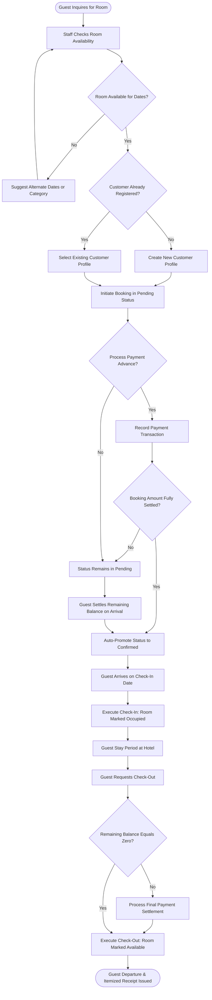

The workflow encapsulates key business rules: (1) Automatic room collision detection, (2) Seamless guest profile attachment, (3) Dynamic confirmation promotion upon full payment, (4) Operational check-in locking room status, and (5) Strict zero-balance checkout enforcement preventing guest departure with outstanding dues.

#### 4.3.6 Entity-Relationship Diagram (ERD)

The Entity-Relationship Diagram defines the complete relational database architecture. Primary keys (`PK`), unique keys (`UK`), foreign keys (`FK`), and entity attributes are explicitly structured. The `CUSTOMERS` entity links to `BOOKINGS` with a one-to-many multiplicity (`1:N`). Similarly, the `ROOMS` entity links to `BOOKINGS` (`1:N`), and each `BOOKINGS` entity links to one or more `PAYMENTS` (`1:N`). The `USERS` and `EMPLOYEES` tables operate independently for authentication and payroll management.

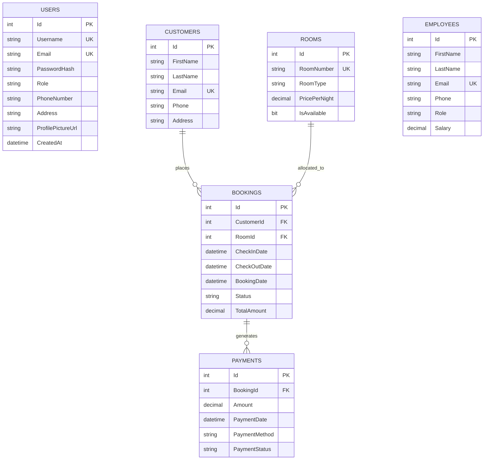

All relational associations between parent and child tables are configured with `DeleteBehavior.Restrict` in Entity Framework Core. This structural safeguard ensures that deleting a customer with historic bookings, deleting a room with active reservations, or deleting a booking with recorded payments is strictly prohibited, protecting audit trails and business records from accidental loss.

#### 4.3.7 Relational Database Schema Specifications

```
TABLE: Users
+--------------------+---------------+-------------+------------------------------------+
| Column Name        | Data Type     | Constraints | Description                        |
+--------------------+---------------+-------------+------------------------------------+
| Id                 | INT           | PK, IDENTITY| Unique user identifier             |
| Username           | NVARCHAR(100) | NOT NULL, UQ| System login handle                |
| Email              | NVARCHAR(150) | NOT NULL, UQ| Corporate user email               |
| PasswordHash       | NVARCHAR(MAX) | NOT NULL    | BCrypt hashed password             |
| Role               | NVARCHAR(50)  | NOT NULL    | Role (Admin, Staff)                |
| PhoneNumber        | NVARCHAR(20)  | NULL        | Contact phone number               |
| Address            | NVARCHAR(250) | NULL        | Physical address                   |
| ProfilePictureUrl  | NVARCHAR(MAX) | NULL        | Base64 / URL profile avatar image  |
| CreatedAt          | DATETIME2     | NOT NULL    | Timestamp of creation (UTC)        |
+--------------------+---------------+-------------+------------------------------------+

TABLE: Customers
+--------------------+---------------+-------------+------------------------------------+
| Column Name        | Data Type     | Constraints | Description                        |
+--------------------+---------------+-------------+------------------------------------+
| Id                 | INT           | PK, IDENTITY| Unique customer identifier         |
| FirstName          | NVARCHAR(100) | NOT NULL    | Guest given name                   |
| LastName           | NVARCHAR(100) | NOT NULL    | Guest family name                  |
| Email              | NVARCHAR(150) | NOT NULL, UQ| Guest contact email address        |
| Phone              | NVARCHAR(20)  | NOT NULL    | Guest telephone number             |
| Address            | NVARCHAR(250) | NOT NULL    | Guest residential address          |
+--------------------+---------------+-------------+------------------------------------+

TABLE: Rooms
+--------------------+---------------+-------------+------------------------------------+
| Column Name        | Data Type     | Constraints | Description                        |
+--------------------+---------------+-------------+------------------------------------+
| Id                 | INT           | PK, IDENTITY| Unique room identifier             |
| RoomNumber         | NVARCHAR(20)  | NOT NULL, UQ| Room designator (e.g., 101, 201)   |
| RoomType           | NVARCHAR(50)  | NOT NULL    | Standard, Deluxe, Suite, Penthouse |
| PricePerNight      | DECIMAL(18,2) | NOT NULL    | Nightly rental tariff              |
| IsAvailable        | BIT           | NOT NULL    | 1 = Available, 0 = Maintenance     |
+--------------------+---------------+-------------+------------------------------------+

TABLE: Bookings
+--------------------+---------------+-------------+------------------------------------+
| Column Name        | Data Type     | Constraints | Description                        |
+--------------------+---------------+-------------+------------------------------------+
| Id                 | INT           | PK, IDENTITY| Unique booking reference number    |
| CustomerId         | INT           | FK -> Cust  | Reference to customer entity       |
| RoomId             | INT           | FK -> Room  | Reference to allocated room        |
| CheckInDate        | DATETIME2     | NOT NULL    | Scheduled check-in date            |
| CheckOutDate       | DATETIME2     | NOT NULL    | Scheduled check-out date           |
| BookingDate        | DATETIME2     | NOT NULL    | Booking timestamp                  |
| Status             | NVARCHAR(50)  | NOT NULL    | Pending, Confirmed, CheckedIn, etc.|
| TotalAmount        | DECIMAL(18,2) | NOT NULL    | Computed total reservation fee     |
+--------------------+---------------+-------------+------------------------------------+

TABLE: Payments
+--------------------+---------------+-------------+------------------------------------+
| Column Name        | Data Type     | Constraints | Description                        |
+--------------------+---------------+-------------+------------------------------------+
| Id                 | INT           | PK, IDENTITY| Unique transaction ID              |
| BookingId          | INT           | FK -> Book  | Associated booking ID              |
| Amount             | DECIMAL(18,2) | NOT NULL    | Payment transaction amount         |
| PaymentDate        | DATETIME2     | NOT NULL    | Transaction timestamp (UTC)        |
| PaymentMethod      | NVARCHAR(50)  | NOT NULL    | Cash, Credit Card, Bank Transfer   |
| PaymentStatus      | NVARCHAR(50)  | NOT NULL    | Paid, Pending, Failed              |
+--------------------+---------------+-------------+------------------------------------+

TABLE: Employees
+--------------------+---------------+-------------+------------------------------------+
| Column Name        | Data Type     | Constraints | Description                        |
+--------------------+---------------+-------------+------------------------------------+
| Id                 | INT           | PK, IDENTITY| Unique employee identifier         |
| FirstName          | NVARCHAR(100) | NOT NULL    | Staff first name                   |
| LastName           | NVARCHAR(100) | NOT NULL    | Staff last name                    |
| Email              | NVARCHAR(150) | NOT NULL, UQ| Staff email address                |
| Phone              | NVARCHAR(20)  | NOT NULL    | Staff telephone number             |
| Role               | NVARCHAR(50)  | NOT NULL    | Designation (Manager, Receptionist)|
| Salary             | DECIMAL(18,2) | NOT NULL    | Monthly base salary                |
+--------------------+---------------+-------------+------------------------------------+
```

The schema tables above represent the physical database layout generated by Entity Framework Core 9 migrations. Column constraints, nullability rules, and unique indices (on `Email`, `Username`, and `RoomNumber`) are configured to guarantee relational integrity. Decimal columns utilize fixed precision `(18, 2)` to eliminate floating-point rounding discrepancies during financial calculations.

#### 4.3.8 Data Flow Diagram: Level 0 (Context Diagram)

The Level 0 Context Diagram depicts the high-level boundary of The Haunted Hotel Management System. It models the system as a single central process interacting with external entities. Front Desk Staff provide booking parameters, customer details, check-in requests, and payment transactions, receiving room availability reports, reservation confirmations, and invoice receipts.

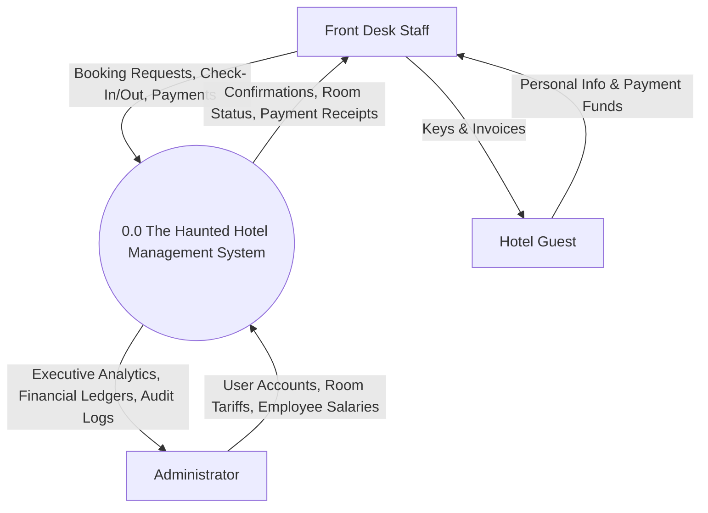

System Administrators supply user account configurations, room pricing definitions, and employee payroll records, receiving aggregated operational analytics, revenue ledgers, and audit logs. Hotel guests interact externally with front desk personnel, providing personal registration data and payment funds in exchange for room keys and itemized billing statements.

#### 4.3.9 Data Flow Diagram: Level 1 (Decomposition Diagram)

The Level 1 Data Flow Diagram decomposes the system into six core automated sub-processes: Authentication and Session Management (1.0), Room Inventory Control (2.0), Customer Directory Management (3.0), Booking and Reservation Engine (4.0), Financial Ledger and Payments (5.0), and Executive Analytics and Reports (6.0).

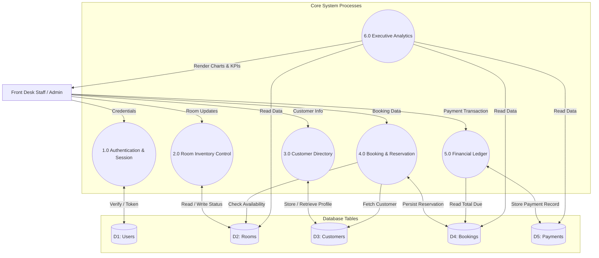

The sub-processes interact with five primary relational data stores: D1 (Users), D2 (Rooms), D3 (Customers), D4 (Bookings), and D5 (Payments). Process 4.0 reads room inventory data from D2 to verify date availability and customer profiles from D3 before persisting reservations into D4. Process 5.0 reads booking totals from D4 and writes financial transactions to D5. Process 6.0 queries across D2, D4, and D5 to compute real-time occupancy metrics, 6-month revenue trends, and financial ledger summaries for management review.

---

## 5. Software Development

### 5.1 Backend Architectural Design (Clean Architecture)
The backend architecture is structured around four strictly decoupled layers adhering to the Clean Architecture (Onion Architecture) pattern:
1. **`HotelManagement.Domain`:** Encapsulates pure business entities (`Room`, `Customer`, `Booking`, `Payment`, `Employee`, `User`) without external package dependencies.
2. **`HotelManagement.Application`:** Defines repository interfaces (`IBookingRepository`, `IRoomRepository`, etc.), service interfaces, DTO schemas, and business logic execution.
3. **`HotelManagement.Infrastructure`:** Implements data persistence with Entity Framework Core 9, `HotelDbContext`, LINQ repository implementations, database configurations, and BCrypt security services.
4. **`HotelManagement.API`:** ASP .NET Core (.NET 10) Web API presentation layer exposing RESTful controllers, JWT Bearer authentication, and Swagger OpenAPI documentation.

### 5.2 Dependency Injection and Security Pipeline
Services and repositories are registered with Scoped lifetimes in `Program.cs`. Incoming requests are routed through a robust security pipeline:

```
[HTTP Request]
       |
       v
[Global Exception Middleware (RFC 7807)]
       |
       v
[CORS Policy (AllowFrontend: http://localhost:5173)]
       |
       v
[JWT Bearer Authentication Handler]
       |
       v
[Role-Based Authorization Filters]
       |
       v
[API Controller -> Application Service -> Repository -> SQL Server]
```

### 5.3 Categorized RESTful API Endpoints

All endpoints except `/api/auth/*` require a valid JWT token in the `Authorization: Bearer <token>` header.

#### 5.3.1 Authentication Endpoints (`AuthController`)

| Method | Route | Authorization | Description |
|---|---|---|---|
| POST | `/api/auth/register` | Public | Register a new user account |
| POST | `/api/auth/login` | Public | Log in and receive JWT token |

#### 5.3.2 User Profile Endpoints (`ProfileController`)

| Method | Route | Authorization | Description |
|---|---|---|---|
| GET | `/api/profile` | Authenticated | Get current user's profile details |
| PUT | `/api/profile` | Authenticated | Update user phone, address, or avatar |
| PUT | `/api/profile/change-password` | Authenticated | Change account password |

#### 5.3.3 Dashboard Analytics Endpoints (`DashboardController`)

| Method | Route | Authorization | Description |
|---|---|---|---|
| GET | `/api/dashboard` | Staff, Admin | Get all aggregated dashboard analytics and KPIs |

#### 5.3.4 Room Inventory Endpoints (`RoomsController`)

| Method | Route | Authorization | Description |
|---|---|---|---|
| GET | `/api/rooms` | Staff, Admin | List all rooms |
| GET | `/api/rooms/{id}` | Staff, Admin | Get room details by ID |
| POST | `/api/rooms` | Admin | Create a new room |
| PUT | `/api/rooms/{id}` | Admin | Update room price, type, or maintenance status |
| DELETE | `/api/rooms/{id}` | Admin | Delete room (blocked if active bookings exist) |
| GET | `/api/rooms/available` | Staff, Admin | Filter available rooms for a date range |

#### 5.3.5 Customer Directory Endpoints (`CustomersController`)

| Method | Route | Authorization | Description |
|---|---|---|---|
| GET | `/api/customers` | Staff, Admin | List all customers (supports search) |
| GET | `/api/customers/{id}` | Staff, Admin | Get customer by ID |
| POST | `/api/customers` | Staff, Admin | Create a new customer profile |
| PUT | `/api/customers/{id}` | Staff, Admin | Update customer details |
| DELETE | `/api/customers/{id}` | Staff, Admin | Delete customer (blocked if bookings exist) |
| GET | `/api/customers/{id}/bookings` | Staff, Admin | Get booking history for a customer |

#### 5.3.6 Booking Management Endpoints (`BookingsController`)

| Method | Route | Authorization | Description |
|---|---|---|---|
| GET | `/api/bookings` | Staff, Admin | List bookings (supports status filter) |
| GET | `/api/bookings/{id}` | Staff, Admin | Get booking details by ID |
| POST | `/api/bookings` | Staff, Admin | Create a new booking |
| PUT | `/api/bookings/{id}` | Staff, Admin | Update booking dates or room allocation |
| PATCH | `/api/bookings/{id}/confirm` | Staff, Admin | Confirm a pending booking |
| PATCH | `/api/bookings/{id}/check-in` | Staff, Admin | Check in (room marked occupied) |
| PATCH | `/api/bookings/{id}/check-out` | Staff, Admin | Check out (requires full payment) |
| PATCH | `/api/bookings/{id}/cancel` | Staff, Admin | Cancel booking |
| DELETE | `/api/bookings/{id}` | Staff, Admin | Delete booking (blocked if payments exist) |

#### 5.3.7 Payment Ledger Endpoints (`PaymentsController`)

| Method | Route | Authorization | Description |
|---|---|---|---|
| GET | `/api/payments` | Staff, Admin | List all payment transactions |
| GET | `/api/payments/{id}` | Staff, Admin | Get payment transaction by ID |
| POST | `/api/payments` | Staff, Admin | Record a payment (auto-confirms if fully paid) |
| GET | `/api/payments/booking/{bookingId}` | Staff, Admin | Get payments for a booking |
| GET | `/api/payments/booking/{bookingId}/summary` | Staff, Admin | Get payment summary (total, paid, remaining) |

#### 5.3.8 Employee Administration Endpoints (`EmployeesController`)

| Method | Route | Authorization | Description |
|---|---|---|---|
| GET | `/api/employees` | Admin | List all employees and payroll salaries |
| GET | `/api/employees/{id}` | Admin | Get employee by ID |
| POST | `/api/employees` | Admin | Create a new employee |
| PUT | `/api/employees/{id}` | Admin | Update employee details and salary |
| DELETE | `/api/employees/{id}` | Admin | Delete employee record |

---

### 5.4 Global Exception Handling and Error Pipeline
The `GlobalExceptionHandler` implements `IExceptionHandler` to intercept all uncaught exceptions, mapping them to standard RFC 7807 ProblemDetails:
* `InvalidOperationException` -> HTTP 400 Bad Request
* `ArgumentException` -> HTTP 400 Bad Request
* `UnauthorizedAccessException` -> HTTP 401 Unauthorized
* `KeyNotFoundException` -> HTTP 404 Not Found
* `DbUpdateException` (Unique Index Violation 2601/2627) -> HTTP 409 Conflict
* Unhandled Server Exceptions -> HTTP 500 Internal Server Error (internal stack traces never leaked)

### 5.5 Frontend UX/UI Design System and State Pipeline
The frontend is constructed using React 19, Vite, and React Router v7. State is managed via React context (`AuthContext`) and local component hooks. Axios request interceptors automatically attach the JWT token from `localStorage`, while response interceptors detect 401 Unauthorized errors to automatically purge expired tokens and redirect to `/login`.

```css
/* Core Design Tokens - Custom Dark Theme */
:root {
  --bg-primary: #0f172a;       /* Deep Slate */
  --bg-secondary: #1e293b;     /* Card Surface */
  --bg-tertiary: #334155;      /* Inputs & Borders */
  --accent-primary: #6366f1;   /* Indigo Brand Accent */
  --accent-hover: #4f46e5;     /* Dark Indigo Hover */
  --text-primary: #f8fafc;     /* Bright White Text */
  --text-secondary: #94a3b8;   /* Muted Slate Text */
  --status-available: #10b981; /* Emerald Green */
  --status-occupied: #ef4444;  /* Crimson Red */
  --status-pending: #f59e0b;   /* Amber Orange */
}
```

---

### 5.6 User Interface Implementations and Screenshots

#### 5.6.1 User Registration and Authentication
The registration module provides a secure onboarding interface for new operators. Users enter their username, email address, password, role (Admin or Staff), phone number, and physical address. Passwords are encrypted on the server with BCrypt before storage. The system validates uniqueness on email and username, rejecting duplicates with clear error toasts. Upon successful registration, a JWT token is issued, and the user is authenticated immediately.

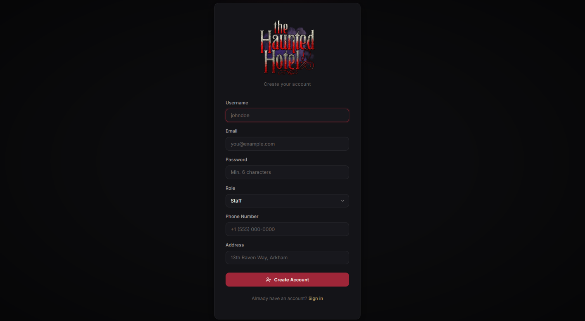

The login screen authenticates staff and administrators by verifying credentials against stored cryptographic hashes. The issued JWT token is stored securely in browser local storage and attached to all subsequent requests via an Axios interceptor. If a token expires or is revoked, the interceptor automatically clears the session and redirects the user back to the login screen.

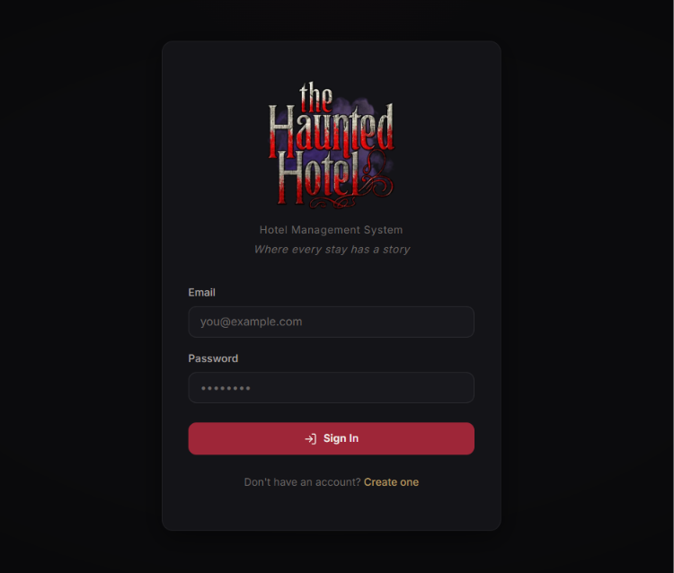

#### 5.6.2 Navigation Architecture
The persistent sidebar navigation organizes system access into three logical modules: Overview (Executive Dashboard), Management (Rooms, Customers, Bookings), and Finance (Payments, Employees). The sidebar footer displays the authenticated user's avatar, username, and assigned role, alongside an instant logout button. On mobile devices, the sidebar collapses into a responsive overlay.

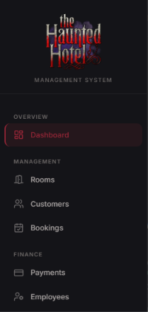

#### 5.6.3 Executive Management Dashboard
The executive dashboard provides a real-time operational overview upon login. The top section features six KPI summary cards displaying Total Rooms across categories, Available Rooms ready for check-in, Occupied Rooms currently checked in, Active Bookings in pending or confirmed states, Total Customers, and Total Revenue collected from paid transactions.

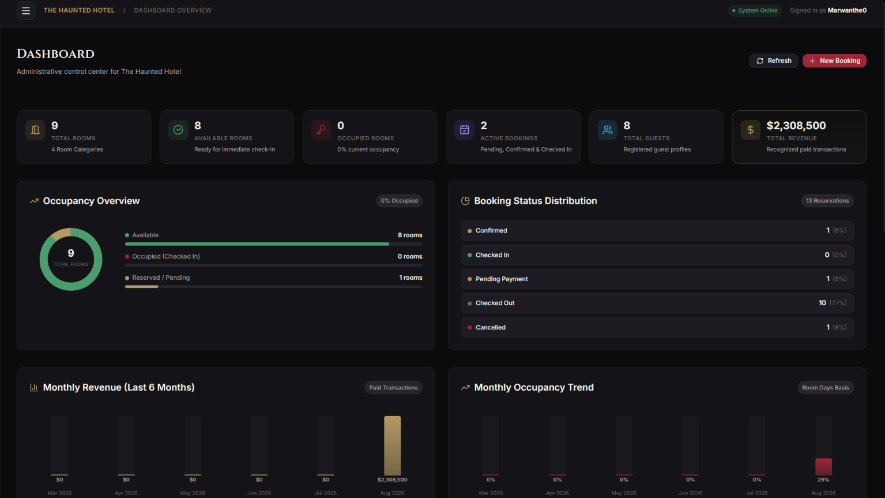

The middle dashboard section features an interactive SVG occupancy donut chart dividing room inventory into Available, Occupied, and Reserved/Pending states. A booking distribution chart visualizes the breakdown across Confirmed, Checked In, Pending Payment, Checked Out, and Cancelled statuses. A 6-month revenue bar chart tracks monthly collections with hover tooltips, while an area chart maps monthly occupancy percentages calculated on a room-days basis.

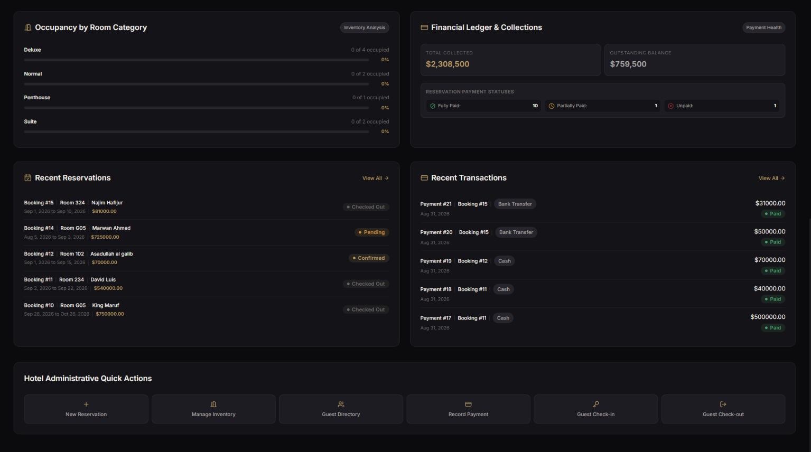

The bottom dashboard section displays room utilization by category (Standard, Deluxe, Suite, Penthouse), a financial ledger comparing Total Collected Revenue against Outstanding Balances, and real-time tables displaying the five most recent reservations and payment transactions. Quick-action shortcut buttons allow receptionists to initiate new bookings, record payments, and process check-ins or check-outs in a single click.

#### 5.6.4 Room Inventory and Reservation Management
The room management view displays all hotel rooms in a table showing Room Number, Category, Nightly Tariff, and Status (Available or Under Maintenance). Administrators can add new rooms, modify pricing or classifications, and toggle maintenance status. Room deletion is blocked if active bookings exist, preserving data integrity. Room numbers are strictly unique across the system.

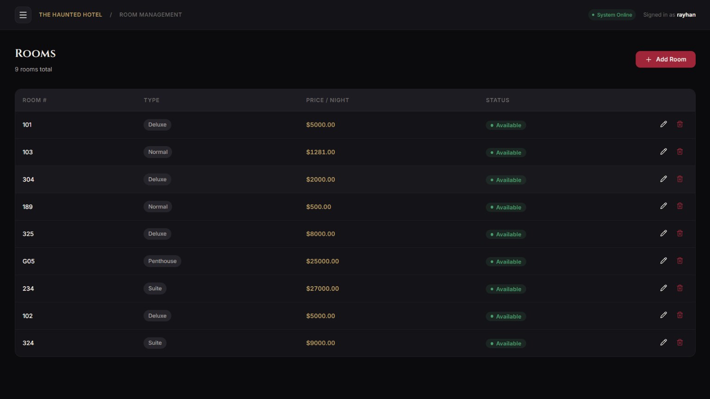

The booking management module manages all reservations with tabbed filtering across All, Pending, Confirmed, Checked In, Checked Out, and Cancelled states. To create a booking, staff select a customer and an available room from dropdown selectors and choose check-in and check-out dates. The total amount is calculated server-side based on the number of nights multiplied by the room tariff. Overlapping reservations for the same room are strictly prevented. Contextual action buttons allow immediate Check-In, Check-Out, Cancellation, or Safe Deletion.

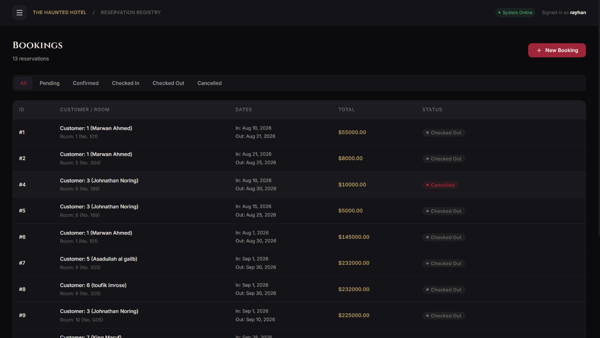

#### 5.6.5 Customer and Employee Directories
The customer directory maintains comprehensive guest master records including first name, last name, verified email, phone number, and residential address. Staff can register new guests, update contact information, or delete records. Customer deletion is prevented if associated reservation records exist, ensuring historical data integrity. A debounced search bar enables real-time filtering by guest name or email address.

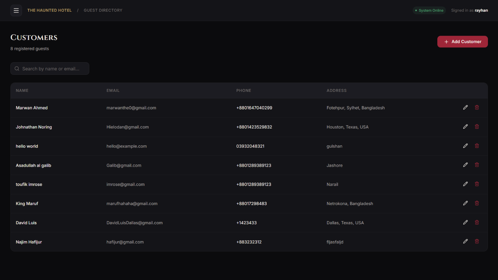

The employee management view provides administrative control over hotel staff records, including managers, receptionists, chefs, security personnel, and housekeeping teams. Each record stores employee full names, contact details, assigned designations, and monthly base salaries. Access to this view is protected by role-based authorization policies, restricting creation, modification, and deletion privileges exclusively to Administrator accounts.

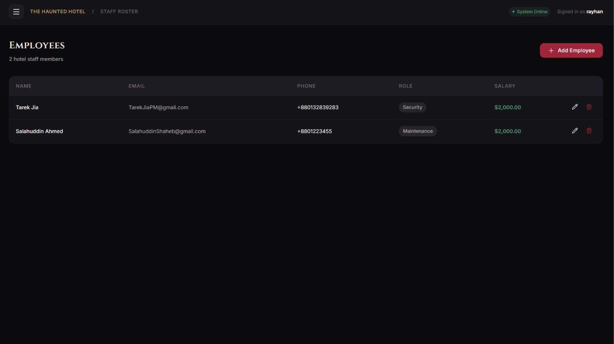

#### 5.6.6 Payment Processing and User Profile
The payment management interface features a payment recording form and a transaction ledger. To record a payment, staff input the Booking ID, and the system dynamically retrieves the booking's total amount, cumulative paid amount, and remaining balance. Staff enter the transaction amount and select the payment method (Cash, Credit Card, Debit Card, or Bank Transfer). When the remaining balance reaches zero, the booking status automatically transitions from Pending to Confirmed. Payments cannot be entered against cancelled reservations, and overpayments are rejected.

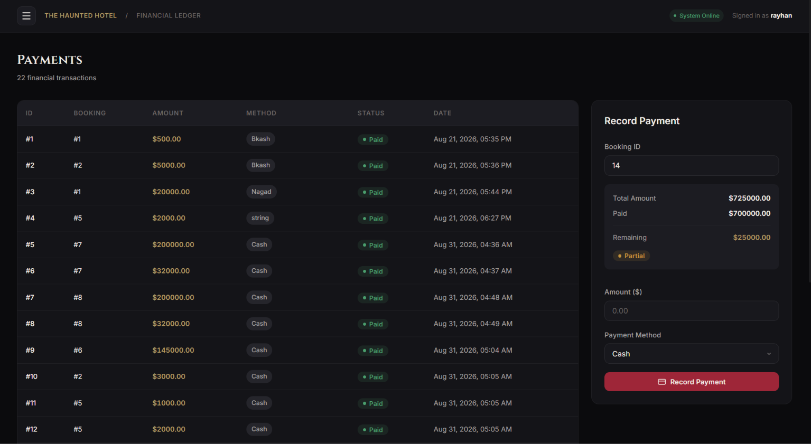

The user profile modal enables authenticated operators to view and update their personal account information. Operators can update their contact phone number, address, display username, and upload custom profile avatar images (stored in base64 format with client-side file size validation). A dedicated password change section requires current password verification before committing new credentials, which are hashed with BCrypt prior to database persistence.

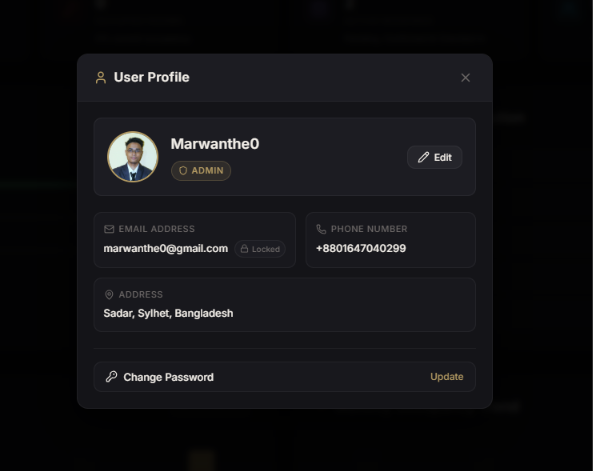

---

## 6. Software Testing

### 6.1 Testing Methodology and Framework
Testing is implemented using **xUnit** and the **Entity Framework Core InMemory provider**. This creates isolated, lightweight, and repeatable test environments that verify domain logic, repository operations, and service workflows without requiring external database dependencies.

```bash
# Test Execution Command
dotnet test tests/HotelManagement.Tests/HotelManagement.Tests.csproj
```

### 6.2 Test Suite Breakdown and Verification Matrix

#### 6.2.1 Authentication Service Tests (`AuthServiceTests.cs`)
* **`Register_CreatesUser_AndReturnsToken`:** Validates user account creation, BCrypt hashing, and valid JWT token issuance.
* **`Register_DuplicateEmail_IsRejected`:** Confirms system throws `InvalidOperationException` upon duplicate email registration.
* **`Login_ValidCredentials_ReturnsJwtToken`:** Verifies successful login and claims generation.
* **`Login_InvalidPassword_IsRejected`:** Confirms system throws `UnauthorizedAccessException` upon incorrect password.

#### 6.2.2 Booking Service Tests (`BookingServiceTests.cs`)
* **`Create_CalculatesTotalOnServer_AndStartsAsPending`:** Verifies 5-night stay @ 2000/night computes to 10,000 total with status 'Pending'.
* **`Create_WithCheckOutBeforeCheckIn_IsRejected`:** Asserts invalid date ranges are rejected.
* **`Create_WithUnknownCustomerOrRoom_IsRejected`:** Asserts invalid foreign keys throw `InvalidOperationException`.
* **`Create_OverlappingBooking_IsRejected`:** Asserts room booking collision detection successfully blocks duplicate allocations.
* **`CancelledBooking_FreesTheRoomForNewBookings`:** Confirms cancelled bookings release the room for subsequent reservations.
* **`FullLifecycle_PendingToCheckedOut_Succeeds`:** Verifies sequential state progression: Pending -> Confirmed -> CheckedIn -> CheckedOut.
* **`InvalidStatusTransitions_AreRejected`:** Rejects invalid jumps (Pending to CheckedIn, Cancelled to Confirmed).
* **`CheckOut_WithOutstandingBalance_IsRejected`:** Asserts checkout is blocked if remaining balance > 0.
* **`Update_RecalculatesTotalFromRoomPrice`:** Confirms rescheduling recalculates totals server-side.
* **`Delete_BookingWithPayments_IsRejected`:** Asserts bookings with financial payment records cannot be deleted.

#### 6.2.3 Payment Service Tests (`PaymentServiceTests.cs`)
* **`Summary_WithNoPayments_IsUnpaid`:** Asserts zero payments result in status 'Unpaid' with full remaining balance.
* **`PartialPayment_ProducesPartiallyPaidSummary`:** Asserts partial payment produces status 'PartiallyPaid'.
* **`MultiplePayments_TotallingTheBooking_ProducePaidSummary`:** Verifies multiple incremental payments total correctly and produce status 'Paid'.
* **`Payment_ExceedingRemainingAmount_IsRejected`:** Confirms overpayment attempts throw `InvalidOperationException`.
* **`Payment_OnFullyPaidBooking_IsRejected`:** Rejects payments on already settled bookings.
* **`Payment_WithNonPositiveAmount_IsRejected`:** Rejects negative or zero payment values (`ArgumentException`).
* **`Payment_OnCancelledBooking_IsRejected`:** Rejects payment attempts against cancelled reservations.

#### 6.2.4 Room and Customer Service Tests (`RoomAndCustomerServiceTests.cs`)
* **`DuplicateRoomNumber_OnCreate_IsRejected`:** Enforces unique room numbers.
* **`DuplicateRoomNumber_OnUpdate_IsRejected`:** Blocks renaming room to an existing number.
* **`DeletingRoom_WithActiveBooking_IsRejected`:** Protects rooms with active reservations from deletion.
* **`DuplicateCustomerEmail_IsRejected`:** Enforces unique customer emails.
* **`DeletingCustomer_WithBookings_IsRejected`:** Blocks deleting customers with booking records.
* **`CustomerSearch_MatchesNameAndEmail`:** Verifies search filtering across first name, last name, and email.
* **`CustomerBookingHistory_ReturnsOnlyThatCustomersBookings`:** Verifies customer history isolation.

#### 6.2.5 Test Execution Summary

| Test Category | Test File | Cases | Status |
|---|---|---|---|
| Authentication | `AuthServiceTests.cs` | 4 | Passed |
| Booking Engine and Lifecycle | `BookingServiceTests.cs` | 10 | Passed |
| Financials and Payments | `PaymentServiceTests.cs` | 8 | Passed |
| Rooms and Customers | `RoomAndCustomerServiceTests.cs` | 8 | Passed |
| Room Availability Logic | `RoomAvailabilityTests.cs` | 5 | Passed |
| **Total Test Suite** | **5 Test Suites** | **35 Test Cases** | **100% Passed** |

---

## 7. Software Implementation and Deployment

### 7.1 Prerequisites
* **.NET 10 SDK:** Required for backend compilation and runtime execution.
* **Node.js (v18.0+) and npm:** Required for frontend dependency bundling and Vite dev server.
* **Microsoft SQL Server (2019+ or LocalDB/Express):** Required for relational data storage.
* **Modern Web Browser:** Google Chrome, Mozilla Firefox, Microsoft Edge, or Safari.

### 7.2 Backend Setup and Database Migrations
1. Open terminal and navigate to API directory:
   ```bash
   cd src/HotelManagement.API
   ```
2. Configure connection string in `appsettings.json`:
   ```json
   {
     "ConnectionStrings": {
       "DefaultConnection": "Server=localhost;Database=HotelManagementDb;Trusted_Connection=True;TrustServerCertificate=True;"
     },
     "Jwt": {
       "Key": "HotelManagement_Super_Secret_Key_At_Least_32_Chars!",
       "Issuer": "HotelManagementAPI",
       "Audience": "HotelManagementClient"
     }
   }
   ```
3. Apply EF Core database migrations:
   ```bash
   dotnet ef database update --project ../HotelManagement.Infrastructure
   ```
4. Start the ASP .NET Core (.NET 10) backend server:
   ```bash
   dotnet run
   ```
   *The backend API starts on `http://localhost:5048` with Swagger documentation at `http://localhost:5048/swagger`.*

### 7.3 Frontend Setup and Development Execution
1. Open a new terminal and navigate to the frontend directory:
   ```bash
   cd frontend
   ```
2. Install npm dependencies:
   ```bash
   npm install
   ```
3. Launch Vite development server:
   ```bash
   npm run dev
   ```
   *The application interface opens at `http://localhost:5173` with automatic API reverse-proxying to port 5048.*

### 7.4 Verification and Test Execution
Execute the automated test suite from the repository root:
```bash
dotnet test tests/HotelManagement.Tests/HotelManagement.Tests.csproj
```
All test suites will execute in-memory and report 100% pass rates.

---

## 8. Conclusion and Future Scopes

### 8.1 Conclusion
The Haunted Hotel Management System successfully resolves the critical operational bottlenecks inherent in traditional hotel administration. By leveraging ASP .NET Core (.NET 10) Clean Architecture, React 19 Single Page Application architecture, Entity Framework Core 9, and Microsoft SQL Server, the system achieves:
* Real-time room inventory management eliminating overbooking incidents.
* Server-side financial integrity enforcing strict rate calculations and balance verifications.
* Complete role-based access control protecting confidential employee payroll and user management.
* Comprehensive visual business intelligence delivering live occupancy trends, revenue distributions, and financial health metrics.

### 8.2 Future Scopes
1. **Online Channel Manager Integration:** Direct bidirectional API synchronization with global Online Travel Agencies (OTAs) such as Booking.com, Airbnb, and Agoda.
2. **Direct Payment Gateway Integration:** Integration of live online payment gateways (Stripe, SSLCommerz, bKash/Nagad) for automated guest payment webhooks.
3. **Automated Guest Notifications:** SMS and email notification triggers for instant booking confirmations, invoice delivery, and check-in reminders.
4. **Point of Sale (POS) Integration:** Expansion into integrated dining, laundry, and mini-bar billing linked to room accounts.
